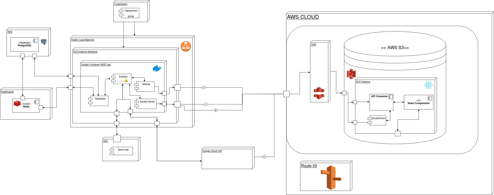
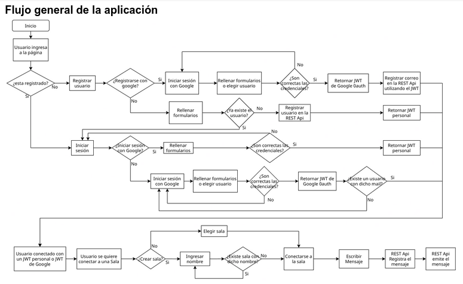
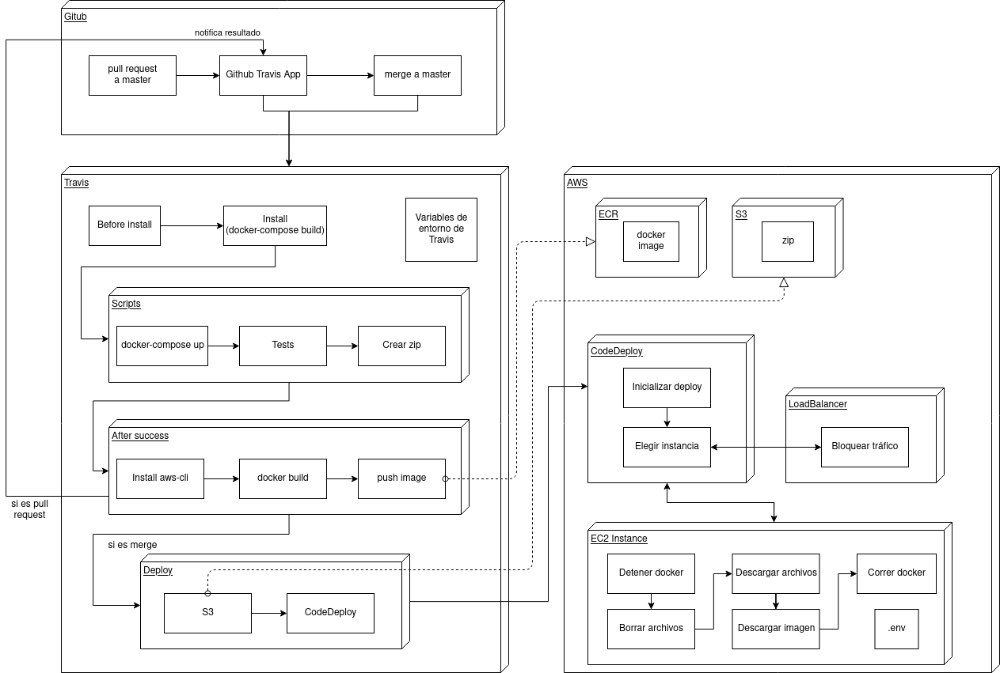

# IIC2173 - Entrega 3


## Consideraciones generales
Toda la documentación se encuentra [en este archivo](DocumentaciónE2grupo20.pdf), pero también se presenta más abajo según se enumeran los requisitos.

La api se puede encontrar en [open-chat-api.tk](https://open-chat-api.tk). El frontend se puede encontrar en [open-chat.ml](https://open-chat.ml). El backend corre en instancias EC2 con un ELB y AutoScalingGroup. La base de datos se encuentra en DRS. El caché está en Elasticaché con Redis. El frontend está almacenado en un bucket de S3 y se consume desde un CDN.


## Método de acceso
El método de acceso elegido fue mediante ssh utilizando una clave, en específico, el archivo ```allsshinstance.pem``` para las instancias de backend y base de datos.

Para acceder al backend con ssh:

`ssh -i "allsshinstance.pem" ubuntu@ec2-18-217-26-21.us-east-2.compute.amazonaws.com`.


## Requisitos

### Parte mínima

#### Autenticación

##### RF1: logrado
Se utiliza GoogleAuth

##### RF2: logrado
Se implementa OAuth mediante la API de GoogleAuth

##### RF3: logrado


##### RF4 (opcional): no implementado

#### CI/CD

##### RF1: logrado
El flujo se encuentra [aquí](docs/FlujoCICD.png) y se utiliza commitlint y standard-version para semantic versioning. Para un nuevo release, basta correr yarn run standard-version y luego git push --set-tags.

##### RF2: logrado
Se utiliza travis.

##### RF3: logrado
Se implementan 3 tests, que se encuentran en `scripts/tests/`

##### RF4: logrado
Para CD, las variables de entorno de las instancias se almacenan en un archivo .env que, a su vez, es guardado en una AMI.

Para el caso de CI, se guardan como variable de entorno en travis. Las variables sensibles se almacenan de modo que no se puede ver su valor.

#### Documentación

##### RF1: logrado
Diagrama de componentes de la aplicación


##### RF2: logrado


##### RF3: logrado
El flujo de CI/CD desde el pull request hasta el deploy en EC2.


##### RF3: logrado
La documentación de la API se realizó mediante POSTMAN y se encuentra en [este readme](api.md).


### Sección variable

#### CRUD admin

##### RF1: logrado

##### RF2: logrado

##### RF3: logrado

#### CSS/JS injection

##### RF1: logrado

##### RF2: logrado

##### RF3: logrado
Las documentación se encuentra en el word.
